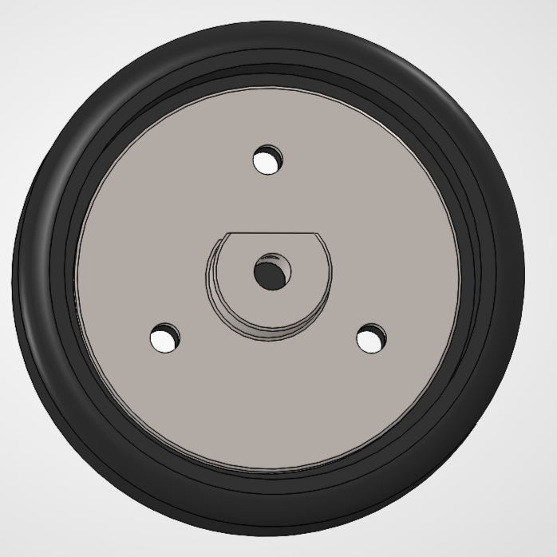
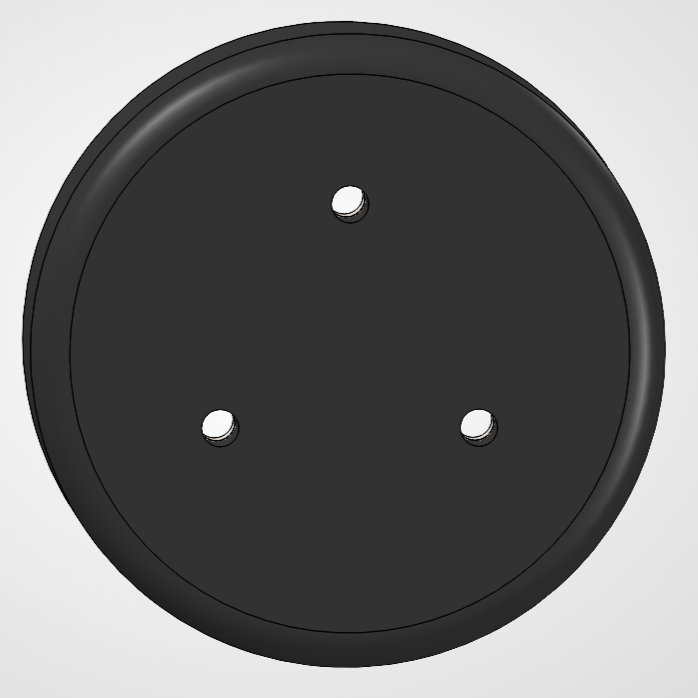
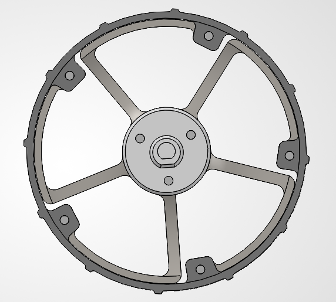
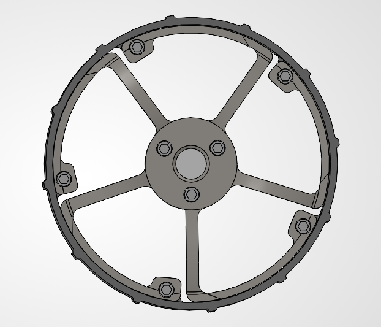

<!--
Colors:
FFFFFF - Pure white
e01e37 - Bold crimson-red 

Hi,
I don't even know why I made this a repo.
Like, tbh it's just meh. Though who knows,
I'll archive it straight off the bat.

- William Bowley, 22nd of September 2026
-->

### Overview

A rover contains many subsystems, drivetrain, suspension, etc. But because the domain knowledge for each is so large, 
for the majority of engineers it's unreasonable to attack it as a whole. Hence, the subsystem decomposition.

This repository therefore contains the design, analysis, and conceptual implementation of the wheels subsystem 
within a sandbox moon-to-Mars rover project for `OENG1250` between the 4th of September and 22nd of September.

---

### L1 - Detailed Design

For the design of the wheels, the requirements in the `Group Design Project` report were used to estimate the different speeds of the vehicle based on the drivetrain's max RPM and the circumference of the wheel.

<div align="center">
<p><em>Resulting table showing speeds for the full validated diameter range.</em></p></div>

See [01_detailed_design](./01_detailed_design) for analysis details.

---

### L2 - Parametric CAD

### Preliminary Design

This design serves as a block design showing the different components within the wheel assembly specifically the interface plate & wheel structure.

<div align="center">
  <table>
    <tr>
      <td></td>
      <td></td>
    </tr>
</table>
  <p><em>Screenshots of preliminary design in solidworks 2026</em></p>
</div>


#### Detailed Design

This design serves as the final design of the rover wheel. The outer diameter was increased to allow for a better hub design, with the hub having a diameter of `90 mm` and the wheel having a diameter of `100 mm`, instead of the preliminary design diameter of `85 mm`. The parts are all 6061 aluminium, and the total mass of the assembly with stainless bolts is `~118.50 g`. The two bolt sizes used were M3 x 6 mm and M3 x 10 mm, with 5 and 3 of them used respectively.

<div align="center">
  <table>
    <tr>
      <td></td>
      <td></td>
    </tr>
</table>
  <p><em>Screenshots of the final design in solidworks 2026</em></p>
</div>

---

### Documentation

Design notes and implementation details can be found in the repository [issues](https://github.com/rmit-wgbowley/RoverWheels/issues).
#### Tags

```
Project Progress:
----------------------------------------------------
LX → Documentation and project structure
L1 → System-level design and detailed design
L2 → Component modelling and integration into vehicle
----------------------------------------------------
```

---