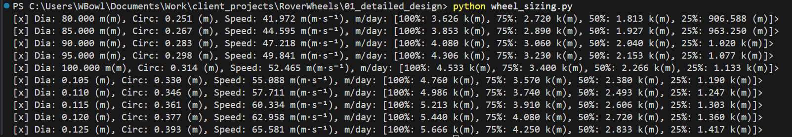

<!--
Colors:
FFFFFF - Pure white
e01e37 - Bold crimson-red 
-->

### Overview


A rover contains many subsystems, drivetrain, suspension, etc. But because the domain knowledge for each is so large, for the majority of engineers it's unreasonable to attack it as a whole. Hence, the subsystem decomposition.

This repository therefore contains the design, analysis, and conceptual implementation of the wheels subsystem within a sandbox moon-to-Mars rover project for `OENG1250` between the 4th of September and 13th of November.

---

### L1 - Detailed Design

For the design of the wheels, the requirements in the `Group Design Project` report were used to estimate the different speeds of the vehicle based on the drivetrain's max RPM and the circumference of the wheel.

<div align="center">
<p><em>Resulting table showing speeds for the full validated diameter range.</em></p></div>

See [01_detailed_design](./01_detailed_design) for analysis details.

---

### L2 - Parametric CAD

> *(Dependency). The CAD implementation is dependent on the detailed design being finished.*
---

### Documentation

Design notes and implementation details can be found in the repository [issues](https://github.com/rmit-wgbowley/RoverWheels/issues).
#### Tags

```
Project Progress:
----------------------------------------------------
LX → Documentation and project structure
L1 → System-level design and detailed design
L2 → Component modelling and integration into vehicle
----------------------------------------------------
```

---